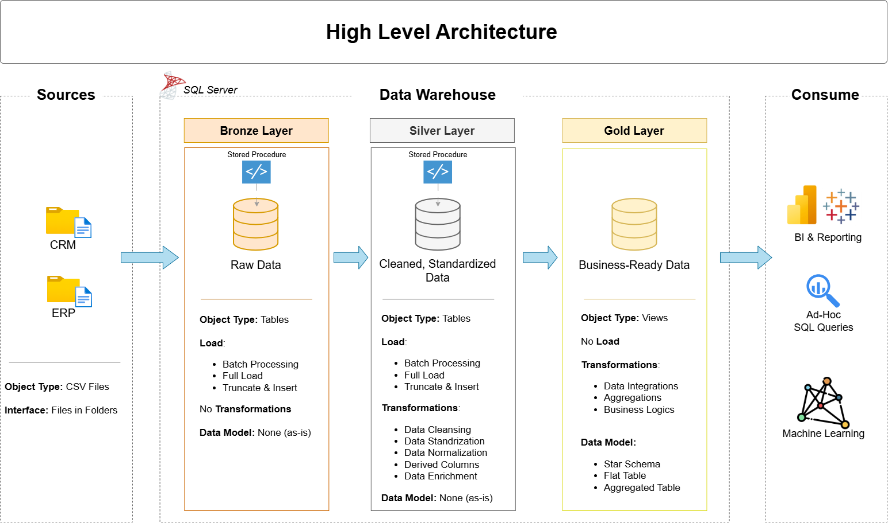

# 数据仓库与分析项目
本项目展示了一个全面的数据仓库与分析解决方案，从构建数据仓库到生成可操作的洞察。作为一个作品集项目，它突出了数据工程与分析的行业最佳实践。

---
## ️ 数据架构
本项目的数据架构遵循勋章式架构 **青铜**、**白银** 和 **黄金** 层：


1. **青铜层**：按原样存储来自源系统的原始数据。数据从 CSV 文件导入到 SQL Server 数据库。
2. **白银层**：该层包括数据清洗、标准化和规范化过程，以准备数据进行分析。
3. **黄金层**：存放业务就绪数据，按报告和分析所需建模为星型模式。

---
## 项目概述
本项目包括：
1. **数据架构**：使用铜（Bronze）、银（Silver）和金（Gold）层的奖牌架构设计现代数据仓库。
2. **ETL 流程**：从源系统提取、转换和加载数据到数据仓库。
3. **数据建模**：开发优化分析查询的事实表和维度表。
4. **分析与报告**：创建基于 SQL 的报告和仪表板以获取可操作的洞察。

## ️ 重要链接与工具：
所有内容均免费！
- **[数据集](datasets/):** 访问项目数据集（csv 文件）。
- **[SQL Server Express](https://www.microsoft.com/en-us/sql-server/sql-server-downloads):** 轻量级服务器，用于托管您的 SQL 数据库。
- **[SQL Server Management Studio (SSMS)](https://learn.microsoft.com/en-us/sql/ssms/download-sql-server-management-studio-ssms?view=sql-server-ver16):** 用于管理和操作数据库的图形用户界面。
- **[Git 仓库](https://github.com/):** 创建 GitHub 账户和仓库，高效管理、版本控制以及协作代码。
- **[DrawIO](https://www.drawio.com/):** 设计数据架构、模型、流程和图表。
- **[Notion](https://www.notion.com/templates/sql-data-warehouse-project):** 获取 Notion 的项目模板。
- **[Notion 项目步骤](https://thankful-pangolin-2ca.notion.site/SQL-Data-Warehouse-Project-16ed041640ef80489667cfe2f380b269?pvs=4):** 访问所有项目阶段和任务。https://app.notion.com/p/3bc4428a16c180f58524d857e6b1371b?source=copy_link

---
## 项目要求
### 构建数据仓库（数据工程）
#### 目标
使用 SQL Server 开发现代数据仓库，整合销售数据，实现分析报告和明智的决策。

#### 规格
- **数据来源**：从两个源系统（ERP 和 CRM）导入数据，这些数据以 CSV 文件提供。
- **数据质量**：在分析前清理并解决数据质量问题。
- **集成**：将两个来源的数据合并为一个用户友好的数据模型，以支持分析查询。
- **范围**：只关注最新的数据集；不需要历史数据存储。
- **文档**：提供清晰的数据模型文档，以支持业务相关方和分析团队。

## 仓库结构
```
data-warehouse-project/
│
├── datasets/                           # 项目使用的原始数据集（ERP 和 CRM 数据）
│
├── docs/                               # 项目文档和架构详情
│   ├── etl.drawio                      # Draw.io 文件展示 ETL 的各种技术和方法
│   ├── data_architecture.drawio        # Draw.io 文件展示项目架构
│   ├── data_catalog.md                 # 数据集目录，包括字段描述和元数据
│   ├── data_flow.drawio                # 数据流图的 Draw.io 文件
│   ├── data_models.drawio              # 数据模型的 Draw.io 文件（星型模式）
│   ├── naming-conventions.md           # 表、列和文件的一致命名指南
│
├── scripts/                            # ETL 和转换的 SQL 脚本
│   ├── bronze/                         # 提取和加载原始数据的脚本
│   ├── silver/                         # 清理和转换数据的脚本
│   ├── gold/                           # 创建分析模型的脚本
│
├── tests/                              # 测试脚本和质量文件
│
├── README.md                           # 项目概述和使用说明
├── LICENSE                             # 仓库的许可信息
├── .gitignore                          # Git 忽略的文件和目录
└── requirements.txt                    # 项目的依赖和需求
```

# 跟着YouTube的baraa自学数据仓库
用法：

  1.下载到本地
  
  2.打开数据库（sql server）
  
  3.在数据库打开scripts里面的init_database.sql并运行（建立新库，和新schema）
  
  4.打开bronze的两个SQL文件分别运行，先d后p，记得运行EXEC脚本（从本地加载数据）
  
  5.打开Silver的两个SQL文件分别运行，先d后p，记得运行EXEC脚本（ETL）
  
  6.打开gold的SQL文件并运行（搭建事实表和维度表，星型模型）
---

## 许可证
本项目根据[MIT许可证](LICENSE)授权。您可以自由使用、修改并共享此项目，并需注明出处。

